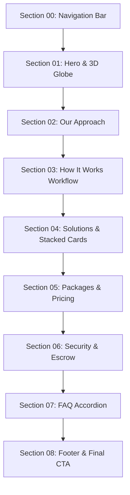

# JAXIS StatLab — Web Landing Page Master Section Specification

> **Target Package**: `apps/web`  
> **Master Design Reference**: [AGENTS.md](file:///c:/Users/ROG%20STRIX/Desktop/JAXIS%20StatLab/AGENTS.md) (Rule 22) & [Dashdark Precision Design System](file:///c:/Users/ROG%20STRIX/Desktop/JAXIS%20StatLab/.agents/skills/dashdark-precision-ui/SKILL.md)  
> **Mandatory Locks**: `max-w-[90rem]` (1,440px) container width, locked typography hierarchy, Enterprise Orange (`#CC6600`) single-color icon rule, zero emojis, precision `rounded-[2px]`.

---

## 1. Global Design Tokens & Palette

### Core Color Palette
| Token Name | Hex Code | Tailwind / RGBA Equivalent | Usage & Role |
|---|---|---|---|
| **Master Canvas** | `#010114` | `bg-[#010114]` | Deep obsidian navy background for the entire landing page. |
| **Card Surface** | `#01142B` | `bg-[#01142B]` / `rgba(1, 20, 43, 0.75)` | Flat precision card substrates and bento container fills. |
| **Elevated Surface** | `#011B38` | `bg-[#011B38]` | Hovered cards, modal backgrounds, elevated dialogs. |
| **Dark Visual Well** | `#010B18` | `bg-[#010B18]` | Embedded document preview boxes, code blocks, terminal frames. |
| **Enterprise Orange** | `#CC6600` | `text-[#CC6600]` / `bg-[#CC6600]` | **Primary Brand Accent**. Icons, active badges, primary CTA buttons, status beacons. |
| **Enterprise Orange Hover** | `#b35500` | `hover:bg-[#b35500]` | Hover state for primary buttons. |
| **Enterprise Orange Glow** | `#FFA040` | `text-[#FFA040]` / `rgba(204, 102, 0, 0.4)` | 3D visual emission, active highlight reflections. |
| **Analytical Sky** | `#38BDF8` | `text-[#38BDF8]` / `text-sky-400` | Secondary accent reserved for verified tags, links, and data metrics. |
| **Verification Emerald** | `#10B981` | `text-[#10B981]` / `text-emerald-400` | Significant p-values, 100% concordance checks, checkmarks. |
| **Escrow Amber** | `#F59E0B` | `text-[#F59E0B]` / `text-amber-400` | Milestones, escrow security indicators. |
| **Border Division** | `rgba(255, 255, 255, 0.10)` | `border-white/10` | Standard hairline border for containers, cards, and dividers. |
| **Border Subtle** | `rgba(255, 255, 255, 0.05)` | `border-white/5` | Secondary table lines and inner sub-card borders. |
| **Text Primary** | `#FFFFFF` | `text-white` | Headlines, card titles, key metric numbers. |
| **Text Secondary** | `rgba(255, 255, 255, 0.70)` | `text-white/70` | Body copy, secondary stats, document titles. |
| **Text Muted** | `rgba(255, 255, 255, 0.60)` | `text-white/60` | Descriptions, section subtitles, parameter values. |
| **Text Dimmed** | `rgba(255, 255, 255, 0.40)` | `text-white/40` | Table headers, stat labels, category duration chips. |

---

## 2. Master Layout & Typography Locks (Directive 22)

### Container Dimensions & Margins
All marketing and landing page sections **MUST** strictly use the unified master container wrapper:
```tsx
<div className="w-full max-w-[90rem] mx-auto px-6 lg:px-8">
```
- **Width**: Locked to `max-w-[90rem]` (1,440px / 90rem). Narrower containers (`max-w-5xl`, `max-w-6xl`, or `max-w-[73.625rem]`) are banned.
- **Edge Gutters**: Responsive `px-6 lg:px-8` (24px mobile/tablet, 32px desktop).
- **Vertical Section Spacing**: `py-12 sm:py-16 lg:py-20` (or `py-16 sm:py-20 lg:py-24`).
- **Corner Radius**: Precision `rounded-[2px]` universally (banned: `rounded-xl`, `rounded-2xl`).

### Typography Hierarchy Lock
| Hierarchy Level | Font Family | Size | Weight | Tracking & Leading | Casing & Color | Rules & Standards |
|---|---|---|---|---|---|---|
| **Section Eyebrow / Kicker** | `font-mono` | `text-xs` (12px) | `font-medium` (500) | `tracking-[0.15em]` | `#CC6600`, ALL-CAPS | Category tag (e.g. `HOW IT WORKS`). Zero double slashes (`//`). |
| **Primary Section Headline** | `font-sans` | `text-2xl sm:text-3xl lg:text-[1.875rem]` | `font-medium` (500) | `tracking-[-0.03em] leading-tight` | `text-white`, Title Case | Primary value prop. Clean Sans-Serif with optical negative tracking. |
| **Section Subtitle (1-Liner)** | `font-mono` | `text-xs sm:text-sm` (12–14px) | `font-normal` (400) | `leading-relaxed` | `text-white/60`, Sentence Case | **1-Liner Standard**: Must use `max-w-3xl lg:max-w-4xl` so it renders on a single uninterrupted line on desktop. |
| **Bento / Feature Card Title** | `font-sans` | `text-sm sm:text-[15px]` (aux) / `text-lg sm:text-xl` (hero) | `font-medium` (500) | `tracking-[-0.02em] leading-snug` | `text-white`, Title Case | High scannability, no aggressive heavy bolding. |
| **Bento Card Description** | `font-mono` | `text-xs` (12px) | `font-normal` (400) | `leading-relaxed` | `text-white/60`, Sentence Case | Concise technical scope description (2–3 lines maximum). |
| **Card Telemetry / Stat Footers** | `font-mono` | `text-[11px] sm:text-xs` | Metric: `font-bold` (700)<br>Label: `font-normal` (400) | Normal tracking | Metric: `text-white`<br>Label: `text-white/40` | Inline telemetry pair (e.g. `100% Upfront delivery`, `α > .80 Reliability target`). |
| **Table Column Headers** | `font-mono` | `text-[9.5px]` | `font-normal` (400) | `tracking-wider`, uppercase | `text-white/40` | Minimalist border division (`pb-1.5 border-b border-white/10`). |
| **Table Data Cells** | `font-mono` | `text-[10.5px]` | `font-normal` (400), values `font-semibold` | Tabular figures | `text-white/80` (values `text-white/90`) | Calm monochrome figures. Decision in `text-white/70`. Anti-rainbow mandate: no neon cyan or green. |
| **Table Diagnostic Footer** | `font-mono` | `text-[9.5px]` | `font-normal` (400) | Normal tracking | `text-white/50`, dot `#CC6600` | Micro-audit tag (e.g. `● Shapiro-Wilk (p = .240, Normal) • N = 384 Responses`). |
| **Action Buttons / CTAs** | `font-sans` | `text-xs sm:text-sm` (12–14px) | `font-medium` (500) | Normal tracking | `text-white`, Title Case | Precision `rounded-[2px]`, `px-5 py-2.5 bg-[#CC6600] active:scale-[0.97]`. Zero shouting ALL-CAPS. |
| **Document Badges** | `font-mono` | `text-[9px]` | `font-normal` (400) | `tracking-wider`, uppercase | `text-white/60 bg-white/[0.06] border border-white/10 px-2 py-0.5 rounded-[2px]` | Subtle verification tag (e.g. `APA 7TH VERIFIED`). |

---

## 3. Section-by-Section Specifications



---

### Section 00: Navigation Bar (`Navbar.tsx`)
- **File**: [`apps/web/app/components/layout/Navbar.tsx`](file:///c:/Users/ROG%20STRIX/Desktop/JAXIS%20StatLab/apps/web/app/components/layout/Navbar.tsx)
- **Container**: `max-w-[1280px] mx-auto px-6 h-16`
- **Substrate**: `bg-[#010114]/90 backdrop-blur-md border-b border-white/10`
- **Brand Lockup**: `/jaxislogo.png` (24x24px) + bold sans `JAXIS` (`#FFFFFF`) `StatLab` (`#CC6600`).
- **Links**: `font-sans text-xs uppercase tracking-wider text-white/70 hover:text-white transition-colors` (`Our Approach`, `How It Works`, `Solutions`, `Pricing`, `Security`, `FAQ`).
- **Action Buttons**:
  - `Sign In`: Ghost link (`text-white/80 hover:text-white font-sans text-xs`).
  - `Get Started`: Precision `rounded-[2px]`, `border border-[#CC6600]/60`, `bg-[#CC6600]/10 hover:bg-[#CC6600]/20 hover:border-[#CC6600] text-white font-sans text-xs font-semibold px-4 py-2 transition-all active:scale-[0.97]`.

---

### Section 01: Hero & Interactive 3D Sphere (`Hero.tsx`)
- **File**: [`apps/web/app/components/sections/Hero.tsx`](file:///c:/Users/ROG%20STRIX/Desktop/JAXIS%20StatLab/apps/web/app/components/sections/Hero.tsx)
- **Container**: Full-width interactive Three.js particle sphere canvas with floating telemetry HUD chips.
- **HUD Micro-Badges**: `font-mono text-xs text-white/70` with emerald status dots (`bg-emerald-400`).
  - `[01] DATA_AUDIT`: "Raw survey data checked · No missing entries"
  - `[02] TEST_SELECTION`: "Correct tests selected · Matched to research questions"
  - `[03] APA_TABLES`: "APA 7th Edition tables · Ready to paste into Chapter 4"
  - `[04] QA_VERIFIED`: "Double-checked by 2 experts · Ready for Thesis Defense"
- **Headlines**:
  - `Defend Your Thesis.` (`#FFFFFF`, bold sans, `text-5xl sm:text-7xl lg:text-8xl tracking-tight`)
  - `With Confidence.` (`#CC6600`, bold sans)
- **Stats Ribbon**: 4-column balanced telemetry (`99.8% Accuracy rate`, `2 Statisticians per study`, `24h Quote turnaround`, `500+ Studies completed`).

---

### Section 02: Our Approach — Scale AI Bento Matrix (`Approach.tsx`)
- **File**: [`apps/web/app/components/sections/Approach.tsx`](file:///c:/Users/ROG%20STRIX/Desktop/JAXIS%20StatLab/apps/web/app/components/sections/Approach.tsx)
- **Container**: `w-full max-w-[90rem] mx-auto px-6 lg:px-8` (Directive 22 Locked)
- **Header**:
  - Eyebrow: `font-mono text-xs uppercase tracking-[0.15em] text-[#CC6600] mb-2 font-medium` (`RESEARCH METHODOLOGIES`)
  - Headline: `font-sans text-2xl sm:text-3xl lg:text-[1.875rem] font-medium text-white tracking-[-0.03em] leading-tight`
  - Subtitle: `font-mono text-xs sm:text-sm text-white/60 mt-2 max-w-3xl lg:max-w-4xl leading-relaxed` (Locked 1-liner on desktop)
- **Grid Layout**: 4-Column Asymmetric Bento Grid (`grid grid-cols-1 md:grid-cols-2 lg:grid-cols-4 bg-[#01142B] border border-white/10 rounded-[2px] overflow-hidden`).
- **Icon Rule**: Single-color Enterprise Orange (`text-[#CC6600]`) with Phosphor Fill (`weight="fill"`). Zero rainbow colors.
- **Card Matrix**:
  1. `Card 1 (Top-Left 2x2 Hero)`: Multi-Tier Statistical Consultation (`Calculator` icon) + compact findings preview table (`OUTPUT_CHAPTER_4_FINDINGS.DOCX` + `APA 7TH VERIFIED`).
  2. `Card 2 (Col 3, Row 1)`: Descriptive Statistics (`Table` icon) | `100% Upfront delivery`
  3. `Card 3 (Col 4, Row 1)`: Inferential Testing (`ChartLineUp` icon) | `50/50 Milestone escrow`
  4. `Card 4 (Col 3, Row 2)`: Multivariate Modeling (`TreeStructure` icon) | `Doctoral Scopus/WOS grade`
  5. `Card 5 (Col 4, Row 2)`: Dual-Pass Peer Review (`ShieldCheck` icon) | `r = 1.00 Concordance gate`
  6. `Card 6 (Bottom-Left 2x1 Wide)`: Reproducible Computational Scripts (`Code` icon) | `100% Complete script ownership`
  7. `Card 7 (Col 3, Row 3)`: Instrument Reliability (`CheckCircle` icon) | `α > .80 Reliability target`
  8. `Card 8 (Col 4, Row 3)`: DefenseLab™ Coaching (`GraduationCap` icon) | `1-on-1 Simulated oral panel`

---

### Section 03: How It Works — 4-Step 3D Workflow (`HowItWorks.tsx`)
- **File**: [`apps/web/app/components/sections/HowItWorks.tsx`](file:///c:/Users/ROG%20STRIX/Desktop/JAXIS%20StatLab/apps/web/app/components/sections/HowItWorks.tsx)
- **Container**: `w-full max-w-[90rem] mx-auto px-6 lg:px-8` (Directive 22 Locked)
- **Section Spacing**: `py-16 sm:py-20 lg:py-24 bg-[#010114] text-white`
- **Header**:
  - Eyebrow: `font-mono text-xs uppercase tracking-[0.15em] text-[#CC6600] mb-2 font-medium text-center` (`HOW IT WORKS`)
  - Headline: `font-sans text-2xl sm:text-3xl lg:text-[2rem] font-medium text-white tracking-[-0.03em] leading-tight text-center mb-14 sm:mb-20` (`From request to ready`)
- **Visual Asset Standard**: **REAL 3D ISOMETRIC IMAGE ASSETS EXCLUSIVELY**. Zero Phosphor icons or emojis permitted as step graphics.
- **CSS Blending**: All 4 image assets use `mix-blend-screen` inside `w-28 h-28 sm:w-36 sm:h-36 md:w-40 md:h-40 shrink-0` to guarantee 100% seamless transparency against the `#010114` canvas without bounding-box edges.

#### 3D Image Asset Generation Recipes & Prompts

The table below documents the exact generation prompts, parameters, and render recipes used to generate the 4 bespoke 3D isometric dark-mode assets:

| Step | Asset File Path | Display Name | Exact Generation Prompt | Hex Colors & Aesthetics |
|---|---|---|---|---|
| **01** | `/images/how-it-works/step-1-submit.jpg` | **Intake Interface Terminal** | `3D isometric floating dark glass tablet interface screen showing a minimalist data input form, dark theme, matte charcoal and deep navy materials, glowing enterprise orange #CC6600 lines and orange glowing button, floating at a 45 degree isometric angle, isolated on a completely solid pitch black background #000000 with zero white or light areas, high contrast dark tech render, Octane render, sleek modern product visual` | `#000000` pitch black background, `#01142B` dark glass body, `#CC6600` glowing orange input borders and button, `#FFA040` highlight glow. |
| **02** | `/images/how-it-works/step-2-quote.jpg` | **Quotation & SOW Document** | `3D isometric floating dark glass contract document sheet showing structured text lines and quotation data, dark theme, matte charcoal glass paper, glowing enterprise orange #CC6600 circular verification seal badge floating on the side, floating at a 45 degree isometric angle, isolated on a completely solid pitch black background #000000 with zero white or light areas, high contrast dark tech render, Octane render, cinema 4D` | `#000000` pitch black background, `#08101E` translucent frosted glass document, `#CC6600` / `#FFA040` circular holographic seal badge with checkmark. |
| **03** | `/images/how-it-works/step-3-validate.jpg` | **Computational Engine Cube** | `3D isometric dark tech computational server cube with glowing enterprise orange #CC6600 core floating inside, matte dark charcoal metal casing, holographic data beam rising from center, floating at a 45 degree isometric angle, isolated on a completely solid pitch black background #000000 with zero white or light areas, high contrast dark tech render, Octane render, cinema 4D` | `#000000` pitch black background, matte dark carbon/titanium cube casing, `#CC6600` internal fusion reactor sphere, vertical orange holographic data trace beam. |
| **04** | `/images/how-it-works/step-4-deliver.jpg` | **Deliverable Storage Vault** | `3D isometric dark database cylinder disk stack, dark theme, matte black metallic cylinders with glowing enterprise orange #CC6600 neon horizontal light rings between disks, floating at a 45 degree isometric angle, isolated on a completely solid pitch black background #000000 with zero white or light areas, high contrast dark tech render, Octane render, cinema 4D` | `#000000` pitch black background, brushed matte black metal disk platters, `#CC6600` / `#FFA040` intense neon horizontal emitter rings. |

#### Step Content & Telemetry Matrix
```tsx
const WORKFLOW_STEPS = [
  {
    step: "01",
    tag: "SUBMIT",
    duration: "5 MINUTES",
    title: "Describe your research study",
    description: "Tell us your statement of the problem, research design, and upload your raw survey data through our encrypted intake portal.",
    imageSrc: "/images/how-it-works/step-1-submit.jpg",
    imageAlt: "3D isometric research study intake portal",
  },
  {
    step: "02",
    tag: "QUOTE",
    duration: "< 24 HOURS",
    title: "Receive your custom quote & SOW",
    description: "Get exact statistical test selections, milestone delivery timeline, and a fixed Scope of Work. Zero scope creep, no commitment required.",
    imageSrc: "/images/how-it-works/step-2-quote.jpg",
    imageAlt: "3D isometric quotation and statement of work sheet",
  },
  {
    step: "03",
    tag: "CALCULATE",
    duration: "2–5 DAYS",
    title: "We analyze & double-verify",
    description: "Our statisticians run your models, followed by an independent Senior QA Lead calculation concordance check to guarantee 100% decimal accuracy.",
    imageSrc: "/images/how-it-works/step-3-validate.jpg",
    imageAlt: "3D isometric computational statistical engine",
  },
  {
    step: "04",
    tag: "DELIVER",
    duration: "DEFENSE READY",
    title: "Download tables & defense script",
    description: "Receive publication-ready APA 7th Edition tables, reproducible computational scripts (.R / SPSS / Python), and word-for-word oral defense scripts.",
    imageSrc: "/images/how-it-works/step-4-deliver.jpg",
    imageAlt: "3D isometric database deliverable vault",
  },
];
```

---

### Section 04: Solutions & Stacked Deliverables (`Solutions.tsx`)
- **File**: [`apps/web/app/components/sections/Solutions.tsx`](file:///c:/Users/ROG%20STRIX/Desktop/JAXIS%20StatLab/apps/web/app/components/sections/Solutions.tsx)
- **Status**: UPGRADED & LOCKED TO STANDARD
- **Container**: `w-full max-w-[90rem] mx-auto px-6 lg:px-8 relative z-10` (Directive 22 Locked)
- **Section Spacing**: `py-16 sm:py-20 lg:py-24 bg-[#010114] text-white`
- **Header**:
  - Eyebrow: `font-mono text-xs uppercase tracking-[0.15em] text-[#CC6600] mb-2 font-medium` (`COMPLETE RESEARCH DELIVERABLES`)
  - Headline: `font-sans text-2xl sm:text-3xl lg:text-[2rem] font-medium text-white tracking-[-0.03em] leading-tight` (`Complete Deliverables. Zero Statistical Anxiety.`)
  - Subtitle: `font-mono text-xs sm:text-sm text-white/60 mt-2 max-w-3xl lg:max-w-4xl leading-relaxed`
  - Right CTA: `inline-flex items-center gap-2 px-5 py-2.5 bg-[#CC6600] hover:bg-[#b35500] text-white font-sans text-xs sm:text-sm font-semibold rounded-[2px] active:scale-[0.97]` with dot
- **Cards**: Flat `#01142B` cards, hairline border `border-white/10`, precision `rounded-[2px]`, pinned scroll stacking timeline with `scrub: 0.6`.
  1. `DELIVERABLE 01`: Spreadsheet Cleaning & Data Health Checks
  2. `DELIVERABLE 02`: Exact Statistical Test Execution & Verification
  3. `DELIVERABLE 03`: Publication-Ready APA 7th Edition Tables & Writeups
  4. `DELIVERABLE 04`: DefenseLab™ Speaking Scripts & Oral Defense Coaching

---

### Section 05: Packages & Custom Quotations (`Pricing.tsx`)
- **File**: [`apps/web/app/components/sections/Pricing.tsx`](file:///c:/Users/ROG%20STRIX/Desktop/JAXIS%20StatLab/apps/web/app/components/sections/Pricing.tsx)
- **Status**: UPGRADED & LOCKED TO STANDARD (Scale AI 2-Column Split Tier Layout)
- **Container**: `w-full max-w-[90rem] mx-auto px-6 lg:px-8` (Directive 22 Locked)
- **Layout Architecture**: 2-Column Responsive Grid (`grid grid-cols-1 lg:grid-cols-12 gap-10 lg:gap-14 xl:gap-16 items-start`)
  - **Left Column (`lg:col-span-5`)**:
    - Eyebrow: `font-mono text-xs uppercase tracking-[0.15em] text-[#CC6600] mb-3 font-medium` (`PRICING`)
    - Headline: `Pay for what you generate.` (white bold) + `<span className="block text-white/50 font-normal">Nothing else</span>`
    - Philosophy Paragraphs: `font-mono text-xs sm:text-sm text-white/60 leading-relaxed max-w-lg mb-4`
  - **Right Column (`lg:col-span-7`)**:
    - Unified container: `border border-white/10 rounded-[2px] bg-[#01142B] overflow-hidden`
    - 3 Horizontal Stacked Tiers divided by hairline `border-b border-white/10`:
      1. **STARTER**: `₱ 1,000` (`font-mono font-bold text-2xl sm:text-3xl text-white`), sublabel `DATASET HEALTH CHECK`, 4 feature checklist items, ghost button `Get started`.
      2. **PROFESSIONAL (Active Highlight)**: Left vertical accent `border-l-2 border-l-[#CC6600]`, elevated substrate `bg-[#011833]`, badge/label `PROFESSIONAL` (`text-[#FFA040]`), `₱ 2,400 / study`, 5 feature checklist items with `#CC6600` checkmarks, solid Enterprise Orange button `Start generating` (`bg-[#CC6600] hover:bg-[#b35500]`).
      3. **ENTERPRISE**: `Custom` (`font-sans font-medium text-2xl sm:text-3xl text-white`), sublabel `DOCTORAL & MULTIVARIATE`, 4 advanced checklist items, ghost button `Talk to sales`.

---

### Section 06: Data Privacy & Escrow Security (`Security.tsx`)
- **File**: [`apps/web/app/components/sections/Security.tsx`](file:///c:/Users/ROG%20STRIX/Desktop/JAXIS%20StatLab/apps/web/app/components/sections/Security.tsx)
- **Status**: UPGRADED & LOCKED TO STANDARD (Scale AI Horizontal Stacked Telemetry Rows)
- **Container**: `w-full max-w-[90rem] mx-auto px-6 lg:px-8` (Directive 22 Locked)
- **Section Spacing**: `py-16 sm:py-20 lg:py-24 bg-[#010114] text-white`
- **Header Block**:
  - Left: Category kicker `font-mono text-xs uppercase tracking-[0.15em] text-[#CC6600] mb-2 font-medium` (`SECURITY & ETHICS`) + Headline `font-sans text-2xl sm:text-3xl lg:text-[2rem] font-medium text-white tracking-[-0.03em] leading-tight` (`The standards behind every thesis defense`)
  - Right: Enterprise Orange CTA button `Get a quotation` with live status dot (`inline-flex items-center gap-2 px-5 py-2.5 bg-[#CC6600] hover:bg-[#b35500] text-white font-sans text-xs sm:text-sm font-semibold rounded-[2px] active:scale-[0.97]`)
- **Container Architecture**:
  - Unified substrate: `border border-white/10 rounded-[2px] bg-[#01142B] overflow-hidden`
  - 3 Horizontal Stacked Rows divided by hairline `border-b border-white/10`:
    - Each row padding: `p-6 sm:p-8 lg:p-10 flex flex-col lg:flex-row lg:items-center justify-between gap-8 sm:gap-10 hover:bg-white/[0.015]`
    - Left column (`lg:max-w-2xl xl:max-w-3xl`):
      - Kicker tag: `font-mono text-xs uppercase tracking-[0.15em] text-[#CC6600] mb-1.5 font-medium`
      - Title: `font-sans text-lg sm:text-xl font-medium text-white mb-2 tracking-[-0.02em] leading-snug`
      - Description: `font-mono text-xs sm:text-sm text-white/60 leading-relaxed`
    - Right column (`shrink-0 grid grid-cols-2 gap-8 sm:gap-12 lg:gap-14 min-w-[260px] sm:min-w-[320px]`):
      - Numerals: `font-mono font-bold text-3xl sm:text-4xl text-white tracking-tight`
      - Sublabels: `font-mono text-[11px] sm:text-xs text-white/50 uppercase tracking-wider mt-1`
- **Row Content & Metrics**:
  1. `DATA PRIVACY · STRICT NDA`: **100% Client Ownership — legally binding non-disclosure**
     - Stat 1: `100%` (Client data ownership)
     - Stat 2: `0` (Data leaks or shared sets)
  2. `RESEARCH ETHICS · ZERO P-HACKING`: **Zero Data Manipulation — honest scientific mathematics**
     - Stat 1: `0.00` (Tolerance for p-hacking)
     - Stat 2: `100%` (Methodology defended)
  3. `ESCROW PROTECTION · DUAL-AUDITOR QA`: **Milestone Escrow & Dual-Pass Peer Review**
     - Stat 1: `r = 1.00` (Concordance gate)
     - Stat 2: `50/50` (Milestone escrow split)

---

### Section 07: Frequently Asked Questions (`FAQ.tsx`)
- **File**: [`apps/web/app/components/sections/FAQ.tsx`](file:///c:/Users/ROG%20STRIX/Desktop/JAXIS%20StatLab/apps/web/app/components/sections/FAQ.tsx)
- **Status**: UPGRADED & LOCKED TO STANDARD (2-Column Minimalist Hairline Split)
- **Container**: `w-full max-w-[90rem] mx-auto px-6 lg:px-8 relative z-10` (Directive 22 Locked)
- **Section Spacing**: `py-16 sm:py-20 lg:py-28 bg-[#010114] text-white`
- **Layout Architecture**: 2-Column Split (`grid grid-cols-1 lg:grid-cols-12 gap-12 lg:gap-16 xl:gap-24 items-start`)
  - **Left Column (`lg:col-span-5 lg:sticky lg:top-28`)**:
    - Eyebrow: `font-mono text-xs uppercase tracking-[0.15em] text-[#CC6600] mb-3 font-medium` (`FREQUENTLY ASKED QUESTIONS`)
    - Headline: `font-sans text-2xl sm:text-3xl lg:text-[2.25rem] font-medium text-white tracking-[-0.03em] leading-tight mb-4` (`Common questions about our statistical consultation`)
    - Help / Contact Note: `font-mono text-xs sm:text-sm text-white/50 leading-relaxed max-w-sm` (`Can't find what you need? Reach out to consult@jaxisstatlab.com — we're happy to answer anything.`)
    - Action CTA: `inline-flex items-center gap-2 px-5 py-2.5 bg-[#CC6600] hover:bg-[#b35500] text-white font-sans text-xs sm:text-sm font-semibold rounded-[2px] active:scale-[0.97]` with dot
  - **Right Column (`lg:col-span-7`)**:
    - Container: `border-t border-white/[0.08]`
    - Row items: `border-b border-white/[0.08]` hairline divider rows directly on the `#010114` canvas (zero bulky cards or boxed borders)
    - Question row: `py-5 sm:py-6 flex items-center justify-between gap-6 text-left group cursor-pointer`
    - Question typography: `font-sans text-sm sm:text-[15px] lg:text-base font-normal sm:font-medium text-white/85 group-hover:text-white transition-colors duration-150`
    - Minimalist toggle icon: Phosphor `<Plus size={16} weight="bold" />` (`text-white/40 group-hover:text-white/80`, rotates 45° to `rotate-45 text-[#CC6600]` on open)
    - Smooth pure CSS grid height transition with answer prose in `font-sans text-xs sm:text-sm text-white/60 leading-relaxed` and category tag in `font-mono text-[10px] text-[#CC6600] font-semibold tracking-wider uppercase`

---

### Section 08: Footer & Final CTA (`FooterCTA.tsx`)
- **File**: [`apps/web/app/components/sections/FooterCTA.tsx`](file:///c:/Users/ROG%20STRIX/Desktop/JAXIS%20StatLab/apps/web/app/components/sections/FooterCTA.tsx)
- **Status**: UPGRADED & LOCKED TO STANDARD
- **Container**: `w-full max-w-[90rem] mx-auto px-6 lg:px-8 relative z-10` (Directive 22 Locked)
- **Section Spacing**: `pt-16 sm:pt-20 lg:pt-24 pb-12 bg-[#010114] text-white`
- **Conversion Banner**:
  - Substrate: `p-8 sm:p-12 lg:p-16 rounded-[2px] bg-[#01142B] border border-white/10 relative overflow-hidden shadow-2xl`
  - Eyebrow: `font-mono text-xs uppercase tracking-[0.15em] text-[#CC6600] mb-2 font-medium` (`DEFENSE READINESS CONSULTATION`)
  - Headline: `font-sans text-2xl sm:text-3xl lg:text-[2.25rem] font-medium text-white tracking-[-0.03em] leading-tight mb-4` (`Stop worrying about defense. Start feeling confident.`)
  - Subtitle: `font-mono text-xs sm:text-sm text-white/60 leading-relaxed max-w-xl mx-auto mb-8`
  - Dual action buttons: Title Case `Get Free Thesis Review →` (`bg-[#CC6600]`) + `Review Our Process` ghost button.
  - Footnote badges: `font-mono text-xs text-white/50`.
- **Footer Nav**: Clean brand lockup, operational uptime beacon (`● System Operational v2.4.0`), legal links, and copyright notice.

---

## 4. Future Section Creation & Modification Checklist

Before adding or editing any section in `apps/web`, every developer and AI agent MUST verify:

1. [ ] **Container Width Lock**: Uses `<div className="w-full max-w-[90rem] mx-auto px-6 lg:px-8">`.
2. [ ] **No Emojis**: 0 emojis across all titles, copy, buttons, badges, and tooltips.
3. [ ] **Phosphor Fill Icons Only**: Any icon imported from `@phosphor-icons/react` has `weight="fill"`.
4. [ ] **Single Brand Accent Color**: Icons in card grids strictly use `text-[#CC6600]`. No rainbow cyan, emerald, amber mix.
5. [ ] **Real 3D Assets for Process Flows**: Any workflow / step visual must use real 3D isometric images with `mix-blend-screen` on `#000000` background (never fallback to emojis or raw icons).
6. [ ] **1-Liner Subtitles**: Section subtitles use `max-w-3xl lg:max-w-4xl leading-relaxed` and render as a single continuous line on desktop.
7. [ ] **Typography Family Rule**: Prose, headlines, card titles in `font-sans`; kickers, telemetry, stats, parameters in `font-mono`.
8. [ ] **No Double Slashes**: Zero `//` characters in any visible text.
9. [ ] **Tactile Motion**: Interactive buttons include `active:scale-[0.97]` and precision `rounded-[2px]`.
10. [ ] **Type Check**: Passes `npm run check-types` with 0 errors across the monorepo.
