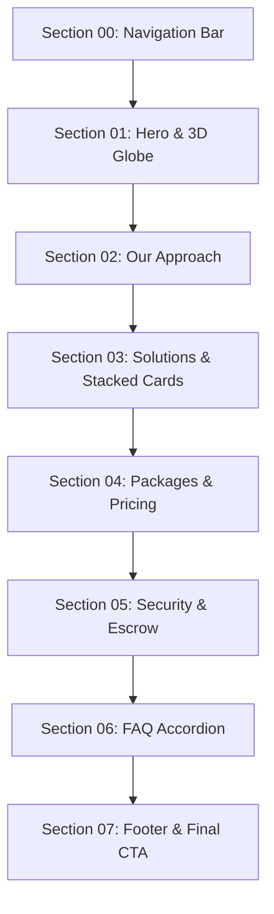

# JAXIS StatLab — Web Landing Page Section-by-Section Revamp Blueprint

> **Status**: APPROVED ROADMAP & TECHNICAL SPECIFICATION  
> **Target Package**: `apps/web`  
> **Master Design Reference**: [Dashdark Precision Design System](file:///c:/Users/ROG%20STRIX/Desktop/JAXIS%20StatLab/.agents/skills/dashdark-precision-ui/SKILL.md) & [AGENTS.md](file:///c:/Users/ROG%20STRIX/Desktop/JAXIS%20StatLab/AGENTS.md)  
> **Rule Enforcement**: Frontend-only, zero double slashes (`//`), precision `rounded-[2px]`, Phosphor fill icons, plain English copy, Emil Kowalski tactile motion, 24px consistent grid rhythm (`gap-6`).

---

## 1. Executive Summary & Revamp Strategy

To elevate the JAXIS StatLab landing page to match the **Dashdark X Enterprise Dark Precision** standard, all modifications will be performed **strictly section by section**.

Each section will be upgraded through a structured 4-phase protocol:
1. **Audit & Deprecate**: Remove anti-patterns (heavy inline CSS, double slashes `//`, blurry glows, emojis, un-styled buttons).
2. **Design System Alignment**: Anchor to canonical substrates (`#010114` canvas, `#01142B` / `#011B38` elevated cards, `#CC6600` enterprise orange accent, `rounded-[2px]`).
3. **Motion & Tactile Polish**: Apply Emil Kowalski interaction physics (`0.97` active compression, smooth cubic-bezier transitions, zero layout jank).
4. **Verification**: Run `check-types` and visual checks to ensure zero regressions before touching the next section.

---

## 2. Section-by-Section Roadmap & Specifications

---

### Section 00: Navigation Bar (`Navbar.tsx`)

**File**: [apps/web/app/components/layout/Navbar.tsx](file:///c:/Users/ROG%20STRIX/Desktop/JAXIS%20StatLab/apps/web/app/components/layout/Navbar.tsx)

#### 1. Current State & Anti-Patterns Identified
- Extensive inline styles instead of idiomatic Tailwind classes.
- Raw SVGs for mobile hamburger toggle instead of Phosphor fill icons (`@phosphor-icons/react`).
- Ad-hoc hover style listeners mutating the DOM directly (`(e.target as HTMLAnchorElement).style.color = ...`).
- CTA button lacks tactile active compression (`:active:scale-97`).

#### 2. Revamp Specification
- **Layout & Structure**:
  - Precision height (`h-16`), backdrop blur `blur-md`, flat hairline bottom border (`border-b border-white/10`).
  - Active scroll state shifts background from `bg-[#010114]/40` to `bg-[#010114]/90` via smooth CSS transition.
- **Brand Identity**:
  - Brand lockup: `/jaxislogo.png` (24x24px) paired with sans-serif bold wordmark (`JAXIS` in white, `StatLab` in Enterprise Orange `#CC6600`).
- **Navigation Links**:
  - Title Case or Clean Sentence Case, `font-sans text-xs uppercase tracking-wider text-white/70 hover:text-sky-400 transition-colors`.
  - Active section indicator: Understated orange underline or micro-dot indicator when scrolling into view.
- **Buttons & Actions**:
  - `"Sign In"`: Clean ghost button with `hover:text-white` and subtle background tint.
  - `"Get Started"`: Precision `rounded-[2px]`, `border border-[#CC6600]/60`, `bg-[#CC6600]/10 hover:bg-[#CC6600]/20 hover:border-[#CC6600] text-white font-sans text-xs font-semibold px-4 py-2 transition-all active:scale-[0.97]`.
- **Mobile Menu**:
  - Drawer uses `<List weight="fill" />` and `<X weight="fill" />` from `@phosphor-icons/react`.
  - Smooth vertical slide-down drawer grounded with `#01142B` surface substrate.

#### 3. Copywriting Plan
- Links: `Our Approach`, `Solutions`, `Packages`, `Security`, `FAQ`, `Contact`.
- Action Buttons: `Sign In`, `Get Started`. Zero jargon, zero emojis.

---

### Section 01: Hero & 3D Particle Globe (`Hero.tsx` + `ParticleGlobe.tsx`)

**Files**: [apps/web/app/components/sections/Hero.tsx](file:///c:/Users/ROG%20STRIX/Desktop/JAXIS%20StatLab/apps/web/app/components/sections/Hero.tsx) & [apps/web/app/components/ui/ParticleGlobe.tsx](file:///c:/Users/ROG%20STRIX/Desktop/JAXIS%20StatLab/apps/web/app/components/ui/ParticleGlobe.tsx)

#### 1. Current State & Anti-Patterns Identified
- Inline styles for layout positioning, mouse parallax, and text wrappers.
- The 4 floating telemetry HUD blocks use text-based checkmarks (`✓`) rather than Phosphor fill icons.
- Parallax cursor tracking is tied to manual inline transform calculations that can cause micro-stutter.
- Headline lines use inline CSS delays rather than orchestrated Tailwind / GSAP animation classes.

#### 2. Revamp Specification
- **3D Particle Performance**:
  - Preserve the 700-particle Fibonacci sphere (`ParticleGlobe.tsx`) with additive blending and raycasted hover glow.
  - Maintain `globeScrollState` proxy for seamless GSAP ScrollTrigger synchronization without React state re-renders.
- **Layout & Vignette Optimization**:
  - Deepen the optical radial contrast gradient to guarantee 100% text contrast over particles at every screen resolution.
  - Responsive headline scale: `text-4xl sm:text-6xl lg:text-7xl font-sans font-light tracking-tight`.
- **Floating Precision HUD Callouts (4 Corners)**:
  - Frame with Dashdark micro-card style: `bg-[#01142B]/80 backdrop-blur-sm border border-white/10 p-3 rounded-[2px] shadow-sm`.
  - Replace raw text glyphs with `<CheckCircle weight="fill" size={14} className="text-emerald-400" />`.
  - Labeling: High-contrast monospace index (`01`, `02`, `03`, `04`) + sans-serif description.
- **Call-to-Action**:
  - Dual action cluster:
    1. Primary: `"Get Started →"` (`rounded-[2px] bg-[#CC6600] text-white font-sans font-semibold text-xs px-6 py-3.5 hover:bg-[#E67300] active:scale-[0.97] transition-all`).
    2. Secondary: `"Explore Methodology"` (ghost outline button with `border-white/20 hover:border-white/40`).
- **Scroll Sequence**:
  - Keep 3-phase pinned GSAP timeline (fade-out $\rightarrow$ globe scale + word-by-word statement reveal $\rightarrow$ dissolve into Section 02).

#### 3. Copywriting Plan
- **HUD Tags**:
  - `01 · DATA AUDIT`: "Raw survey data validated · Zero missing entries"
  - `02 · TEST SELECTION`: "Matched to research questions · Methodology locked"
  - `03 · APA TABLES`: "APA 7th Edition formatted · Copy-paste ready"
  - `04 · VERIFICATION`: "Double-checked by 2 statisticians · Ready for defense"
- **Headline**: "Defend Your Thesis. With Confidence."
- **Lead Text**: "We analyze your survey data, format publication-ready APA 7th Edition tables, and give you the exact speaking script to defend your results with zero fear."

---

### Section 02: Our Approach (`Approach.tsx`)

**File**: [apps/web/app/components/sections/Approach.tsx](file:///c:/Users/ROG%20STRIX/Desktop/JAXIS%20StatLab/apps/web/app/components/sections/Approach.tsx)

#### 1. Current State & Anti-Patterns Identified
- Banned double-slash in section kicker: `SECTION // 02 — HOW WE WORK`.
- Inline styles for all card grids, padding, and text wrappers.
- CAD vector line drawings look great, but the surrounding cards lack consistent 24px grid rhythm (`gap-6`) and Dashdark precision surfaces (`#01142B`).

#### 2. Revamp Specification
- **Header Structure**:
  - Kicker tag: `STEP-BY-STEP WORKFLOW` (zero double slashes).
  - Title: `From Raw Survey Data To Passed Defense.` with Analytical Sky accent.
  - Subtitle: Clear plain-English prose (`text-sm sm:text-base text-white/60 font-sans max-w-xl`).
- **2x2 Bento Matrix**:
  - Grid: `grid grid-cols-1 md:grid-cols-2 gap-6`.
  - Substrate: Flat `#01142B` card, `border border-white/10`, precision `rounded-[2px]`, `p-6 sm:p-8`.
  - Corner Accents: Precision crosshairs (`+`) rendered with subtle opacity (`text-white/20`).
- **Vector Blueprint Visuals**:
  - Retain the interactive SVG stroke-dash animation (draws paths on scroll entry).
  - Upgrade color hierarchy: Sky Blue (`#38BDF8`) for data traces, Enterprise Orange (`#CC6600`) for dimension calipers, white/80 for empirical points.
- **Auditable Spec Matrix**:
  - 2x2 parameter strip at the bottom of each card with clean 1px borders and high-contrast labels.

#### 3. Copywriting Plan (Zero Double Slashes)
- **Step 01**:
  - Code: `STEP 01 OF 04` | Badge: `CUSTOM SOW QUOTE IN 24H`
  - Title: `Send Us Your Chapter 1 & Data`
  - Subtitle: `EXACT TEST MATCHING & FREE REVIEW`
  - Body: "We review your research objectives, statement of the problem, and raw survey data. We determine the exact statistical tests your study actually needs before you spend a single peso."
- **Step 02**:
  - Code: `STEP 02 OF 04` | Badge: `CLEAN DATASET & HEALTH REPORT`
  - Title: `We Clean Your Data & Fix Errors`
  - Subtitle: `SURVEY HEALTH & VALIDITY AUDIT`
  - Body: "We organize your spreadsheet, clean up missing survey responses, and run normality and outlier tests so your panel and adviser never reject your raw data."
- **Step 03**:
  - Code: `STEP 03 OF 04` | Badge: `DOUBLE-VERIFIED CALCULATIONS`
  - Title: `Two Experts Calculate Your Numbers`
  - Subtitle: `ZERO CALCULATION ERROR GUARANTEE`
  - Body: "Your data is analyzed by one statistician and recalculated from scratch by a second senior reviewer. If a single decimal differs, we fix it before you receive your results."
- **Step 04**:
  - Code: `STEP 04 OF 04` | Badge: `APA TABLES & DEFENSE SCRIPT`
  - Title: `You Get Tables & Plain Speaking Scripts`
  - Subtitle: `READY TO PASTE INTO CHAPTER 4`
  - Body: "You receive clean APA tables ready to paste into your manuscript, plus a word-for-word speaking script explaining what every p-value and percentage means during your defense."

---

### Section 03: Solutions & Stacked Deliverables (`Solutions.tsx` + `SolutionCard.tsx`)

**Files**: [apps/web/app/components/sections/Solutions.tsx](file:///c:/Users/ROG%20STRIX/Desktop/JAXIS%20StatLab/apps/web/app/components/sections/Solutions.tsx) & [apps/web/app/components/ui/SolutionCard.tsx](file:///c:/Users/ROG%20STRIX/Desktop/JAXIS%20StatLab/apps/web/app/components/ui/SolutionCard.tsx)

#### 1. Current State & Anti-Patterns Identified
- Banned double-slash in badges: `DELIVERABLE 01 // DATA CLEANING`.
- Section kicker uses `SECTION 03 // WHAT YOU RECEIVE`.
- Heavy inline CSS on cards, header tabs, and feature items.
- Checkmarks in pill tags use plain text unicode `✓` rather than Phosphor fill icon `<CheckCircle weight="fill" />`.

#### 2. Revamp Specification
- **Section Header**:
  - Kicker: `DELIVERABLES INCLUDED` (clean uppercase monospace without `//`).
  - Title: `Complete Deliverables. Zero Statistical Anxiety.`
- **Stacked Card Architecture**:
  - Desktop: GSAP pinned deck with 50px header tabs exposed sequentially at `calc(165px + index * 52px)`.
  - Mobile: Clean vertical stack with `gap-6` without awkward sticky clipping.
- **Card Anatomy Upgrades**:
  - Substrate: `#01142B` body with `#011B38` header tab bar.
  - Border: Crisp 1px `border-white/10`, precision `rounded-[2px]`.
  - Tag Pills: Clean rounded-[2px] chips with `<CheckCircle weight="fill" size={12} className="text-[#CC6600]" />`.
  - 4-Column Feature Grid: Replace inline styles with Tailwind grid (`grid grid-cols-1 sm:grid-cols-2 lg:grid-cols-4 gap-4`).
  - Metric Badges: Bold monospace numeral (`font-mono font-bold text-sky-400`) + uppercase label.

#### 3. Copywriting Plan
- Deliverable 01: `Spreadsheet Cleaning & Data Health Checks` (Data cleanup, Outlier checks, Reliability test, Missing data handling).
- Deliverable 02: `Accurate Calculations & Ready APA 7th Tables` (Demographics, Hypothesis testing, Advanced SEM modeling, Ready APA tables).
- Deliverable 03: `Double-Checked by 2 Independent Statisticians` (Double-blind check, Zero p-hacking, Complete R/Python/SPSS code, Senior QA sign-off).
- Deliverable 04: `Plain-English Speaking Scripts & Mock Defense` (1-on-1 mock panel defense, 20+ defense questions script, null-result defense, free revisions).

---

### Section 04: Packages & Custom Pricing (`Pricing.tsx`)

**File**: [apps/web/app/components/sections/Pricing.tsx](file:///c:/Users/ROG%20STRIX/Desktop/JAXIS%20StatLab/apps/web/app/components/sections/Pricing.tsx)

#### 1. Current State & Anti-Patterns Identified
- Double-slashes across all plan badges (`PLAN 01 // SURVEY AUDIT`, `PHP // BY QUOTE`).
- Double-slashes in system status footer (`SYS // CUSTOM_QUOTED_PER_STUDY // SOW_APPROVAL_REQUIRED`).
- The Philippine Peso symbol (`₱`) must follow the workspace typography standard (Sans-serif optical weight, never heavy monospace fallback glyph).
- Recommendation tag uses bracketed shouting (`[ RECOMMENDED_FOR_THESIS_DEFENSE ]`).

#### 2. Revamp Specification
- **Grid Spacing**:
  - 2x2 grid using strict `gap-6` (`grid grid-cols-1 md:grid-cols-2 gap-6`).
- **Peso Currency Harmonization**:
  - Ensure the `₱` glyph is rendered in clean `font-sans font-normal opacity-85 select-none inline-block mr-0.5` alongside crisp bold monospace numerals.
- **Featured Plan Card Elevation**:
  - `Core Thesis Package` highlighted with an Enterprise Orange hairline border (`border-[#CC6600]/80`), subtle top accent gradient, and an authoritative badge:
    `RECOMMENDED FOR DEFENSE`.
- **Offerings Bento Split**:
  - DefenseLab card (`₱250/hr`) and delivery upgrade stack styled with unified `rounded-[2px]` and `#01142B` substrates.
- **Buttons**:
  - Action buttons styled with precision `rounded-[2px]`, Title Case (`"Request Custom Quote"`), and tactile `:active:scale-97`.

#### 3. Copywriting Plan (Zero Double Slashes)
- **Kicker**: `TRANSPARENT RATES & CUSTOM SCOPES`
- **Heading**: `Transparent Rates. Custom-Quoted Scopes.`
- **Plan 01**: `DataCheck` — Starts at ₱1,000 · Survey Audit & Health Report
- **Plan 02**: `Start Package` — Starts at ₱1,500 · Demographics & Respondent Profiles
- **Plan 03 (Featured)**: `Core Thesis Package` — Starts at ₱2,400 · Complete Hypothesis Testing
- **Plan 04**: `Advanced Package` — Starts at ₱3,000+ · Complex Multivariate Modeling
- **DefenseLab**: `DefenseLab Module` — ₱250/hr · Live 1-on-1 Mock Panel Defense
- **Upgrades**: `JAXIS Rush` (3 Days · ₱300), `JAXIS Express` (48 Hours · ₱600), `JAXIS Emergency` (24 Hours · ₱1,000).

---

### Section 05: Security, Ethics & Escrow (`Security.tsx`)

**File**: [apps/web/app/components/sections/Security.tsx](file:///c:/Users/ROG%20STRIX/Desktop/JAXIS%20StatLab/apps/web/app/components/sections/Security.tsx)

#### 1. Current State & Anti-Patterns Identified
- Double slashes in section tag (`SECTION // 05 — PRIVACY & INTEGRITY`) and pillar codes (`SEC_01 // ANONYMITY`).
- Double slashes in footer certification (`SYS // STRICT_NDA_LOCK // PII_CLEANSED`).
- Inline CSS throughout.

#### 2. Revamp Specification
- **Iconography**:
  - Incorporate Phosphor fill icons (`@phosphor-icons/react` with `weight="fill"`):
    - `SEC 01`: `<ShieldCheck weight="fill" size={20} className="text-sky-400" />`
    - `SEC 02`: `<Scales weight="fill" size={20} className="text-emerald-400" />`
    - `SEC 03`: `<LockKey weight="fill" size={20} className="text-amber-400" />`
    - `SEC 04`: `<Bank weight="fill" size={20} className="text-[#CC6600]" />`
- **Card Anatomy**:
  - Unified `#01142B` substrate, `border border-white/10`, `rounded-[2px]`, `p-6 sm:p-8`.
  - Corner crosshairs (`+`) with subtle `text-white/20`.
  - 2x2 parameter strip at the base of each card.
- **Footer Status**:
  - Clean authoritative audit badge: `● Strict Non-Disclosure Lock · PII Cleaned · Zero Data Manipulation Verified`.

#### 3. Copywriting Plan (Zero Double Slashes)
- Pillar 01: `100% Anonymity & Data Privacy` — Participant names, IDs, and emails scrubbed before analysts start.
- Pillar 02: `We Never Fake or Manipulate Data` — Zero p-hacking policy; non-significant results scientifically defended.
- Pillar 03: `You Own 100% of Your Research & Code` — Legally binding NDAs signed by all staff; complete client ownership.
- Pillar 04: `Safe Escrow Payment Protection` — Payments protected in escrow; released only upon Senior QA decimal verification.

---

### Section 06: Frequently Asked Questions (`FAQ.tsx`)

**File**: [apps/web/app/components/sections/FAQ.tsx](file:///c:/Users/ROG%20STRIX/Desktop/JAXIS%20StatLab/apps/web/app/components/sections/FAQ.tsx)

#### 1. Current State & Anti-Patterns Identified
- Double slashes in category tags (`// TIMELINE & TURNAROUND`) and section kicker (`SECTION // 06`).
- Expanding toggle uses text `+` character rotated by 45 degrees rather than a dedicated icon.
- Inline styles for accordion item state management.

#### 2. Revamp Specification
- **Accordion Architecture**:
  - Single-item active state (`openIndex`).
  - Pure CSS grid height transition (`grid-template-rows: 0fr -> 1fr`, `300ms cubic-bezier(0.16, 1, 0.3, 1)`) for zero JavaScript layout jank.
- **Visual Elevation**:
  - Inactive card: `bg-[#01142B]/70 border border-white/10 rounded-[2px] hover:border-white/20 transition-all`.
  - Active card: `bg-[#011B38] border border-sky-400/40 rounded-[2px]`.
  - Left indicator: Precision 3px Enterprise Orange vertical strip (`bg-[#CC6600]`) on the active item.
  - Toggle icon: `<CaretDown weight="fill" size={18} className="transition-transform duration-300 ..." />` or `<Plus weight="fill" />`.
- **Category Badge**:
  - Clean monospace micro-badge without double slashes: `TIMELINE & TURNAROUND`.

#### 3. Copywriting Plan
- 6 Essential Questions:
  1. *How fast will I receive my analysis?*
  2. *What if my thesis adviser or panel asks for revisions?*
  3. *Is my survey data and student identity kept confidential?*
  4. *What happens if my results are not statistically significant (p > .05)?*
  5. *I know nothing about statistics. How will I defend my numbers?*
  6. *What exact files will I receive upon delivery?*

---

### Section 07: Footer & Final CTA (`FooterCTA.tsx`)

**Files**: [apps/web/app/components/sections/FooterCTA.tsx](file:///c:/Users/ROG%20STRIX/Desktop/JAXIS%20StatLab/apps/web/app/components/sections/FooterCTA.tsx) & [apps/web/app/components/ui/tailwind-css-background-snippet.tsx](file:///c:/Users/ROG%20STRIX/Desktop/JAXIS%20StatLab/apps/web/app/components/ui/tailwind-css-background-snippet.tsx)

#### 1. Current State & Anti-Patterns Identified
- Inline styles on all footer elements.
- Legal links lack clear hover styling and active states.
- Missing operational status grounding indicator (`● System Operational`).

#### 2. Revamp Specification
- **Conversion Hero Container**:
  - Ambient radial spotlight reveal on scroll (`.bg-glow` via GSAP ScrollTrigger).
  - Centered high-impact typography (`font-sans font-light text-3xl sm:text-5xl tracking-tight`).
  - Action button: `"Get Free Thesis Review"` with Dashdark precision `rounded-[2px]`, `border border-[#CC6600] bg-[#CC6600]/15 hover:bg-[#CC6600] text-white font-semibold text-xs uppercase tracking-widest px-8 py-4 transition-all active:scale-[0.97]`.
- **Global Footer Navigation Bar**:
  - Border: Clean top divider (`border-t border-white/10 pt-8 mt-20`).
  - Left: Brand icon + `JAXIS StatLab` wordmark + Operational status tag:
    ` System Operational`.
  - Right: Legal and compliance links (`Privacy Policy`, `Terms of Service`, `Ethics Standard`, `Escrow Security`) with `hover:text-sky-400` transitions.

#### 3. Copywriting Plan
- Eyebrow: `GET YOUR FREE STATISTICAL CONSULTATION`
- Headline: `Stop worrying about defense. Start feeling confident.`
- Paragraph: "Send us your Chapter 1 or raw survey spreadsheet. Our senior statisticians will review your study and give you an exact, custom Scope of Work quote within 24 hours at zero charge."
- CTA Button: `Get Free Thesis Review`
- Links: `Privacy Policy` · `Terms of Service` · `Academic Ethics & Anti-P-Hacking` · `Escrow Security`

---

## 3. Implementation Plan & Sequencing Checklist

| Order | Target Section | Primary Changes | Verification |
|---|---|---|---|
| **Phase 1** | **Section 00: Navbar** | Clean Tailwind, `rounded-[2px]` CTA, Phosphor mobile icons, active scroll styling | `check-types`, mobile drawer test |
| **Phase 2** | **Section 01: Hero & Globe** | Dashdark precision typography, Phosphor HUD callouts, dual CTA, 0 double slashes | `check-types`, GSAP scroll check |
| **Phase 3** | **Section 02: Approach** | Remove `//`, 2x2 `#01142B` bento matrix, SVG path animation, spec matrix | `check-types`, vector draw test |
| **Phase 4** | **Section 03: Solutions** | Clean tabs, Phosphor checkmarks, 4-column feature grids, responsive stacking | `check-types`, scroll pinning test |
| **Phase 5** | **Section 04: Pricing** | Harmonized Peso `₱` typography, featured badge, DefenseLab bento split | `check-types`, responsive layout check |
| **Phase 6** | **Section 05: Security** | Phosphor fill icons per pillar, `#01142B` cards, zero double slashes | `check-types`, grid rhythm check |
| **Phase 7** | **Section 06: FAQ** | Pure CSS grid interpolation, Phosphor toggle, active `#CC6600` accent bar | `check-types`, accordion toggle test |
| **Phase 8** | **Section 07: Footer CTA** | Ambient spotlight glow, tactile conversion button, system operational status | `check-types`, full page smoke test |

---

*(This document serves as the canonical revamp reference. No section code will be touched without following this exact specification.)*
